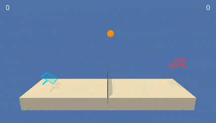

# Udacity Deep Reinforcement Learning Nanodegree

This repository contains exercises and projects I've worked on for the [nanodegree](https://github.com/udacity/deep-reinforcement-learning).

These are my reports for the three main projects, trained using [Unity ML-Agents](https://github.com/Unity-Technologies/ml-agents).

| Navigation | Continuous Control | Collaboration and Competition |
|:---------------------------------:|:------------------:|:-----------------------------:|
|  |  |  |
| Implemented with a Dueling DDQN. See the [README](p1-navigation/README.md) and the [report](p1-navigation/Report.ipynb). | Implemented with A2C-GAE. See the [README](p2-continuous-control/README.md) and the [report](p2-continuous-control/Report.ipynb). | Implemented with MADDPG and self-play. See the [README](p3-collab-compet/README.md) and the [report](p3-collab-compet/Report.ipynb). |

Also, here's a list of exercise notebooks trained on a few [OpenAI Gym](https://github.com/openai/gym) environments.

- [Monte Carlo methods](monte-carlo/Monte_Carlo.ipynb)
- [Temporal difference methods](temporal-difference/Temporal_Difference.ipynb) (SARSA, Q-Learning, Expected-Sarsa)
- [Discretization](discretization/Discretization.ipynb) and [tile coding](discretization/Tile_Coding.ipynb) (Q-Learning)
- [Deep Q-Network](deep-q-network/Deep_Q_Network.ipynb)
- Policy based methods ([Hill Climbing](hill-climbing/Hill_Climbing.ipynb), [Cross Entropy Method](cross-entropy-method/CEM.ipynb))
- Policy gradient methods ([REINFORCE](policy-gradient/pong-REINFORCE.ipynb), [PPO](policy-gradient/pong-PPO.ipynb))

Some python scripts derived from the notebooks are provided as well.
