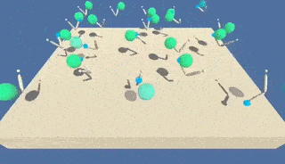

# Continuous Control
**Project 2 of Deep Reinforcement Learning Nanodegree**



> The model used to generate this gif is `final.pth` (A2C-GAE with `n = 8` steps), which was trained for 600 episodes using `main.py`.

## Overview

The environment for this project is [Reacher](https://github.com/udacity/deep-reinforcement-learning/tree/master/p2_continuous-control) from Unity and it is provided in the `setup` folder. In particular, the version with **20 agents** is considered. This repository contains an implementation of the A2C algorithm, a synchronous version of [A3C](https://web.stanford.edu/class/psych209/Readings/MnihEtAlHassibis15NatureControlDeepRL.pdf) and a variant that uses [GAE](https://arxiv.org/pdf/1506.02438.pdf).

For details on the implementation and comparison between the models see the [report](Report.ipynb). Alternatively, you can find some pre-trained models under `models/` and the source code in `main.py` and `code/`.

## Environment

There are 20 independent agents, each with a double-jointed that can move to target locations. At every timestep, the goal location changes, and the goal is to **keep the arm at the target location for as long as possible**. A reward of **+0.1** is provided for each timestep that this is true.

The state space consists of **33 variables** corresponding to position, rotation, velocity, and angular velocities of the arm. 

Actions are in the shape of a vector with **4 continuous values** in the range of **-1** to **1**, corresponding to torque applicable to the two joints.

The task is **episodic** and an episode is evaluated as the average of all the agents' scores. The task is solved when the average score in the environment over 100 consecutive episodes reaches **+30** or more.

## Getting started

> Note that this was tested in macOS only

### Requirements

You'll need [conda](https://docs.conda.io/en/latest/) to prepare the environment and execute the code. 

Other resources are already available in this repository under `setup/`, so you can simply clone it.

```bash
git clone https://github.com/francescotorregrossa/deep-reinforcement-learning-nanodegree.git
cd deep-reinforcement-learning-nanodegree/p2-continuous-control
```

Optionally, you can install [jupyter](https://jupyter.org) if you want to work on the report notebook.

### Create a conda environment

This will create an environment named `p2_continuous_control` and install the required libraries.

```bash
conda create --name p2_continuous_control python=3.6
conda activate p2_continuous_control
unzip setup.zip
pip install ./setup
```

### Watch a pre-trained agent

You can use `main.py` to watch an agent play the game. The provided model `final.pth` is a **A2C-GAE with `n = 8` steps**.

```bash
python main.py
```

If you want to try another configuration, you can use one of the files under `model/` but note that you might also need to [change this line]() in `main.py`.

### Train an agent from scratch

You can also use `main.py` to train a new agent. Again, if you want to change the configuration you have to update [this line](). You'll find other classes and functions in the `code/` folder. The report also contains useful functions for plotting results with `matplotlib`.

```bash
python main.py -t
```

Note that this script will **override** `final.pth`.

### Open the report with jupyter

```bash
python -m ipykernel install --user --name p2_continuous_control --display-name "p2_continuous_control"
jupyter notebook
```

Make sure to set the **kernel** to `p2_continuous_control` after you open the report.

### Uninstall

```bash
conda deactivate
conda remove --name p2_continuous_control --all
jupyter kernelspec uninstall p2_continuous_control
```
