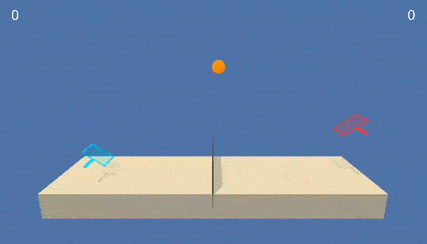

# Collaboration and Competition
**Project 3 of Deep Reinforcement Learning Nanodegree**



> The model used to generate this gif is `final.pth` (MADDPG with two agents that share the networks in a self-play fashion), which was trained for 2000 episodes.

## Overview

The environment for this project is [Tennis](https://github.com/udacity/deep-reinforcement-learning/tree/master/p3_collab-compet) from Unity and it is provided in the `setup` folder. This repository contains an implementation of the [MADDPG algorithm](https://arxiv.org/pdf/1706.02275.pdf) (although not directly from pixels), but in this case two agents share the same actor and critic networks, to allow for a self-play mechanism.

For details on the implementation see the [report](Report.ipynb). Alternatively, you can find the pre-trained model under `models/`.

## Environment

Two agents control rackets to bounce a ball over a net. The goal is to **keep playing for as long as possible**. If an agent hits the ball over the net, it receives a reward of **+0.1**. If an agent lets a ball hit the ground or hits the ball out of bounds, it receives a reward of **-0.01**.

The state space has **24 dimensions per agent** and consists of three consecutive vectors, each of 8 variables. The 8-valued vector contains information about the ball and the agent's racket at a specific frame.

At each timestep, each agent can output an action with **2 continuous dimensions** that represent horizontal and vertical movement of the racket. Values should be between **-1** and **1**.

The task is episodic, and in order to solve the environment, the agents need to score an **average of +0.5** over 100 consecutive episodes, after taking the maximum over both agents.

## Getting started

> Note that this was tested in macOS only

### Requirements

You'll need [conda](https://docs.conda.io/en/latest/) to prepare the environment and execute the code. 

Other resources are already available in this repository under `setup/`, so you can simply clone it.

```bash
git clone https://github.com/francescotorregrossa/deep-reinforcement-learning-nanodegree.git
cd deep-reinforcement-learning-nanodegree/p3-collab-compet
```

Optionally, you can install [jupyter](https://jupyter.org) if you want to work on the report notebook.

### Create a conda environment

This will create an environment named `p3_collab_compet` and install the required libraries.

```bash
conda create --name p3_collab_compet python=3.6
conda activate p3_collab_compet
unzip setup.zip
pip install ./setup
```

### Watch a pre-trained agent

### Train an agent from scratch

### Open the report with jupyter

```bash
python -m ipykernel install --user --name p3_collab_compet --display-name "p3_collab_compet"
jupyter notebook
```

Make sure to set the **kernel** to `p3_collab_compet` after you open the report.

### Uninstall

```bash
conda deactivate
conda remove --name p3_collab_compet --all
jupyter kernelspec uninstall p3_collab_compet
```
